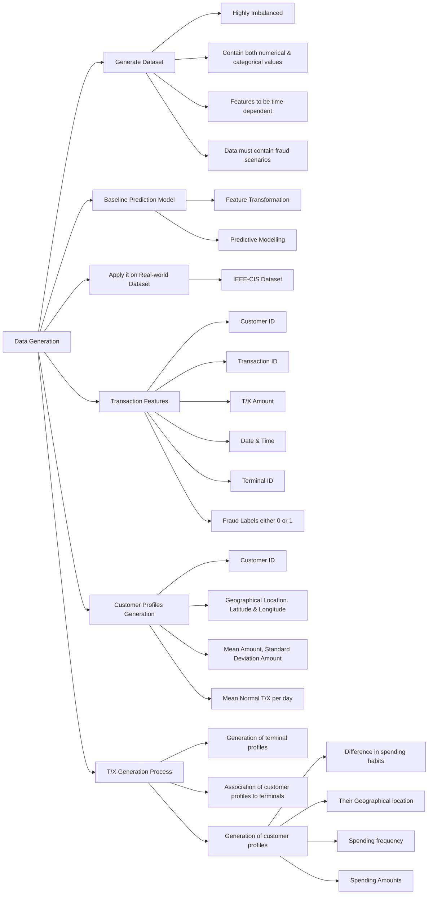

# Model Development 

<figure markdown="span">
    
    <figcaption>Challenges in Dataset</figcaption>
</figure>

## Building the T/X Dataset 

- Generate a dataset having, 5,000 customers, 10,000 terminals and 183 days of transactions.
- 1,754,155 transactions will generated in processing time about 3 minutes.

--- 

## Addition of Fraud Scenarios 

=== "Fraud Scenario 1"

    Any Transaction whose amount is more than 220 is a fraud.

=== "Fraud Scenario 2"

    Everyday 2 terminals drawn at random and keep tracking upto next 28 days and considering them fraudulent.

=== "Fraud Scenario 3"

    Everyday 3 customers are drawn at random.

    - In next 14 days, 1/3rd of their transactions have multiplied by 5 and marked as fraudulent.
    - All Card not present scenarios.

- **Note:** Adding fraudulent scenarios about 14,681 Transactions. The ratio of fraudulent and non-fraudulent is 0.8% of all transactions.  
- This generated dataset shows around **10,000** transactions per day. The number of fraudulent transactions per day is around **85**, which is a significant figure.  

--- 

## Feature Engineering 

### Date & Time features 

!!! note "Generating some more features and scenarios as shown below"
    - Weekdays  
    - Weekends  
    - Day  
    - Night  

### Customer ID features 

!!! note "Transforming Customer ID to characterize customer behavior"
    - RFM (Recency, Frequency, Monetary) value.  
    - Keep track of average spending amount & number of transactions.  
    - Creating 6 new features based on their behavior on working days, non-working days, vacations, and tours, etc.  

### Method used for transactions 

1. Using cards:

    - Lost cards  
    - Skimming the cards  
    - Ordered a new card on the wrong address  

2. Without using cards:  

    - Using Mobile/laptop and their versions  
    - Using Net-banking / UPI / third-party apps  
    - Loss of UPI PIN  

---

## Choosing the IEEE-CIS Dataset 

   - IEEE-CIS Fraud Detection dataset is a large-scale dataset that contains transaction data from an e-commerce platform.  
   - The dataset includes a wide range of features, such as transaction amount, product category, and customer information.  
   - This meets the criteria for building a robust fraud detection model and merging the generated dataset with the **REAL WORLD** dataset.  
   - The dataset contains 590,540 transaction details of 393 different features in the training dataset.  

---

### Working on the Dataset 

   - After compiling the generated and IEEE-CIS dataset, there are many challenges in building the fraud detection model, such as:  
     - Imbalance dataset between fraud and non-fraud dataset.  
     - Dealing with a huge number of features.  
     - Selection of correct and most important features.  
     - Handling missing values.  
     - Scaling the features.  

<figure markdown="span">
    
    <figcaption>Model Flowchart</figcaption>
</figure>
