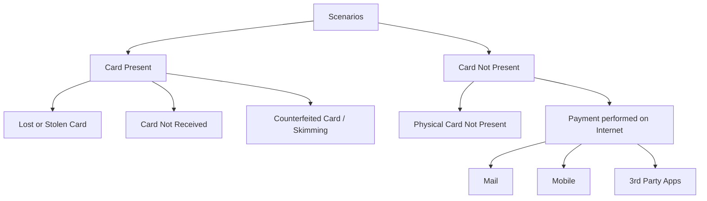
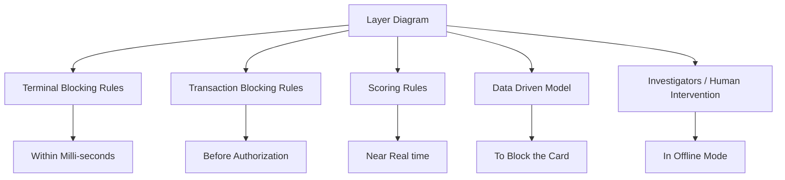
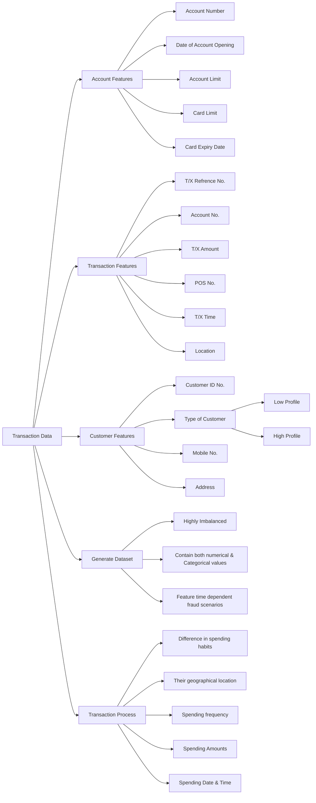

# Research and Journey 

## Nilson Report 

**Nilson Report** is the most trusted source of news and analysis for the card and mobile payment industry.  
[The latest Nilson Report](https://fraud-detection-handbook.github.io/fraud-detection-handbook/Chapter_References/bibliography.html#id3) from 2019 reveals that global card fraud losses reached $28.65 billion. **Card fraud losses** are projected to reach **$35.31 billion** by 2025, highlighting the urgent need for advanced fraud detection systems.

<figure markdown="span">
    
    <figcaption>Nilson Report</figcaption>
</figure>

**Online payment fraud** is a growing concern for businesses and consumers alike. As e-commerce continues to expand, fraudsters are finding new ways to exploit vulnerabilities in online transactions.  

--- 

## European Central Bank 

**European Central Bank** (ECB) data shows that card fraud losses in the Single Euro Payments Area (SEPA) reached €1.55 billion in 2019.  
[The **ECB**](https://fraud-detection-handbook.github.io/fraud-detection-handbook/Chapter_References/bibliography.html#id2) has been working to enhance payment security through the implementation of the **Revised Payment Services Directive (PSD2)**.

<figure markdown="span">
    
    <figcaption>European Central Bank Report</figcaption>
</figure>

The **PSD2** aims to improve the security of online payments and protect consumers from fraud. By requiring strong customer authentication for electronic transactions, the directive seeks to reduce the risk of fraud and enhance the overall security of the payment ecosystem.  

---

## Well Known PIN Codes | Advanced Techniques (Biometric identification)

### Purpose 

1. Automated systems should optimize the workload of fraud investigators.
2. Automated systems and human investigators work at different time scales:

    - **Automated systems**:  
        - Usually provide risk scores for transactions in less than a second.

    - **Fraud investigators**:  
        - Usually require contacting a client to confirm a fraud, which can take days or weeks.

---

### Scenarios 

[CP Scenarios](https://fraud-detection-handbook.github.io/fraud-detection-handbook/Chapter_2_Background/CreditCardFraud.html) have existed for more than 2 decades and are robust to fraud attacks, notably due to **EMV** (Europay Mastercard & Visa) technology.  

---

### Layer Diagram 

<figure markdown="span">
    
    <figcaption>Layer Control Diagram</figcaption>
</figure>

Investigators design transaction-blocking & scoring rules layers.

1. Check few alerts/day as the process is long & tedious.  
1. Investigate the wrong/false alarms raised by DDM (Data Driven Model) and reported back to real-time FDS (Fraud Detection System).
3. High scores of DDM for fraud will pass the Investigators layers, and contact/send alerts using SMS.

---

### Variation in Transaction Data 

